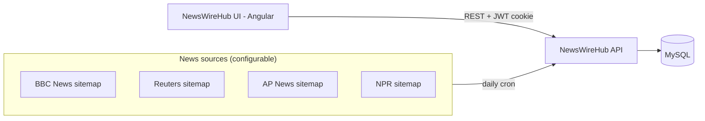

# NewsWireHub

NewsWireHub is a full-stack news aggregation and content management platform. It periodically
crawls the public XML sitemaps of multiple news outlets, extracts article metadata (title,
description, thumbnail), stores everything in a relational database, and exposes it through a
secured REST API and an Angular single-page application for browsing, searching, and curating
articles by channel.

This repository is a single, unified monorepo containing the backend API, the frontend UI, the
infrastructure-as-code, and the CI/CD pipeline needed to run the whole platform end to end. It
uses a **configurable, multi-source** sitemap aggregator rather than being tied to any single
news outlet.

## Contents

- [Overview](#overview)
- [Project structure](#project-structure)
- [Tech stack](#tech-stack)
- [Architecture](#architecture)
- [Multi-source sitemap configuration](#multi-source-sitemap-configuration)
- [Getting started](#getting-started)
  - [Prerequisites](#prerequisites)
  - [Run everything with Docker Compose](#run-everything-with-docker-compose)
  - [Run the backend locally](#run-the-backend-locally)
  - [Run the frontend locally](#run-the-frontend-locally)
- [Configuration reference](#configuration-reference)
- [API overview](#api-overview)
- [Authentication & roles](#authentication--roles)
- [CI/CD (Jenkins)](#cicd-jenkins)
- [Infrastructure (Terraform / AWS)](#infrastructure-terraform--aws)
- [Testing](#testing)

## Overview

- **Backend**: Spring Boot 3 REST API (Java 21) that fetches sitemap indexes from any number of
  configured news sources, deduplicates and stores them, then asynchronously crawls each article
  URL to extract Open Graph metadata.
- **Frontend**: Angular 22 single-page application with Angular Material, providing dashboards,
  search, channel browsing, article curation, and user/role administration.
- **Infrastructure**: Terraform definitions for AWS (EC2, ECS, ECR, RDS, IAM) and a Jenkins-based
  CI/CD pipeline for building, containerizing, and deploying the stack.

## Project structure

```
NewsWireHub/
├── backend/            Spring Boot 3 REST API (Java 21)
│   ├── src/main/java   Application source (controllers, services, models, security, ...)
│   ├── src/test/java   Unit tests
│   ├── pom.xml         Maven build definition
│   └── Dockerfile      Backend container image
├── frontend/           Angular 22 single-page application
│   ├── src/app         Components, services, models
│   ├── package.json    NPM dependencies/scripts
│   └── Dockerfile      Frontend container image (nginx)
├── ci-cd/              Jenkins pipeline script and agent setup notes
├── terraform/          AWS infrastructure as code (EC2, ECR, ECS, IAM, RDS)
└── docker-compose.yml  Local orchestration of db + api + ui
```

## Tech stack

| Layer      | Technology                                              |
|------------|----------------------------------------------------------|
| Backend    | Java 21, Spring Boot 3.3, Spring Security 6, Spring Data JPA, Hibernate |
| Auth       | JWT (jjwt 0.12), BCrypt password hashing, HTTP-only cookies |
| Database   | MySQL 8.4                                                 |
| Docs       | springdoc-openapi 2 (OpenAPI 3 / Swagger UI)              |
| Scraping   | Jsoup 1.18, Jackson XML (Woodstox)                        |
| Frontend   | Angular 22, Angular Material 22, RxJS 7                   |
| Infra      | Terraform (AWS: EC2, ECS, ECR, RDS, IAM), Docker, Docker Compose |
| CI/CD      | Jenkins                                                   |

## Architecture



Every night (default: midnight, `Europe/Athens`), the backend's `ArticleService` iterates over
all configured `sitemap.news.sources`, fetches each site's root sitemap index, filters out
already-known and disallowed sitemap URLs, then crawls the new sitemaps concurrently to pull in
individual articles and enrich them with `og:title`, `description`, and `og:image` metadata.

## Multi-source sitemap configuration

NewsWireHub is built around a **generic, multi-source** design instead of being hardcoded to any
single news outlet:

- `sitemap.news.sources` (in `application.properties`) accepts a comma-separated list of root
  sitemap index URLs — any number of sites, from any domain.
- The channel name for each discovered sitemap is derived **generically** from the sitemap URL's
  own host and path (e.g. `bbc.co.uk-technology`, `reuters.com-world`), so sources never collide
  and no source-specific code changes are required to add or remove a site.
- `sitemaps.disallowed` accepts a comma-separated list of full sitemap URLs to skip (useful for
  excluding ad/voucher/archive sitemaps that some sites publish).

To add a new source, just append its sitemap index URL to `sitemap.news.sources` — no code
changes needed. Always check the target site's `robots.txt` and terms of use before scraping.

## Getting started

### Prerequisites

- Java 21 (JDK)
- Maven (or use the bundled `./mvnw`)
- Node.js 22+ and npm
- Docker and Docker Compose (for the containerized setup)
- MySQL 8.x (if running the backend outside Docker)

### Run everything with Docker Compose

The fastest way to run the full stack (database + API + UI) locally:

```bash
docker compose up --build
```

This starts:

- `db` — MySQL 8.4 on port `3306`
- `api` — the Spring Boot backend on port `8080`
- `ui` — the Angular frontend (served via nginx) on port `4200`

### Run the backend locally

```bash
cd backend
# configure a local MySQL instance and export DB_HOST, or edit application.properties directly
./mvnw spring-boot:run
```

The API will be available at `http://localhost:8080`, with interactive API docs at
`http://localhost:8080/swagger-ui.html`.

### Run the frontend locally

```bash
cd frontend
npm install
npm start
```

The UI will be available at `http://localhost:4200`. Update `src/app/AppSettings.ts` if your
backend is not running on `http://localhost:8080`.

## Configuration reference

Backend configuration lives in `backend/src/main/resources/application.properties`:

| Property                        | Description                                              |
|----------------------------------|------------------------------------------------------------|
| `spring.datasource.url`          | JDBC URL, defaults to `jdbc:mysql://${DB_HOST}:3306/news` |
| `spring.datasource.username/password` | Database credentials                                |
| `sitemap.news.sources`           | Comma-separated list of sitemap index URLs to aggregate  |
| `sitemaps.disallowed`            | Comma-separated list of sitemap URLs to skip             |
| `newswirehub.app.jwtSecret`      | HMAC secret used to sign JWTs (**change in production**) |
| `newswirehub.app.jwtCookieName`  | Name of the auth cookie                                  |
| `newswirehub.app.jwtExpirationMs`| JWT/cookie lifetime in milliseconds                       |

> Set `DB_HOST` as an environment variable pointing to your MySQL host (Docker Compose sets this
> automatically for the `api` service).

## API overview

All endpoints are under `/api`. Highlights:

**Articles & sitemaps** (`/api/app`):
- `GET /getAllArticles`, `GET /getArticle?loc=`, `POST /addArticle`, `PUT /updateArticle`,
  `DELETE /deleteArticle?loc=`
- `GET /getAllArticlesByChannel/{channelName}`, `GET /channelNames`, `GET /countUrlsByChannel`,
  `GET /latestArticleByChannel`
- `GET /getAllSitemaps`, `POST /addSitemap`, `DELETE /deleteSitemap?loc=`
- `POST /triggerSitemapNewsMapping` — manually kick off the sitemap crawl instead of waiting for
  the nightly cron job

**Auth & users** (`/api/auth`):
- `POST /register`, `POST /authentication`, `POST /logout`
- `GET /getAllUsers`, `DELETE /deleteUser/{username}`, `PUT /changeUserRole/{username}/role`

Full interactive documentation is available via Swagger UI at `/swagger-ui.html` once the
backend is running.

## Authentication & roles

- Authentication uses a JWT stored in an HTTP-only cookie (not local storage), signed with
  HMAC-SHA and validated on every request via a `OncePerRequestFilter`.
- Three roles are supported: `VIEWER`, `EDITOR`, `ADMINISTRATOR`, enforced with Spring Security
  method security.
- Passwords are hashed with BCrypt.

## CI/CD (Jenkins)

The `ci-cd/` folder contains:

- `setup.txt` — one-time Jenkins agent setup notes (Docker, Terraform CLI, SDKMAN, Java 21,
  Maven, AWS CLI).
- `script.sh` — the pipeline script that:
  1. Provisions the RDS database and ECR repository via Terraform.
  2. Builds the backend with Maven.
  3. Builds and pushes the Docker image to ECR.
  4. Applies the remaining Terraform resources (EC2, ECS task definition, IAM).
  5. Restarts the ECS task with the freshly pushed image.

Set `AWS_ACCOUNT_ID` and `AWS_REGION` as environment variables (or Jenkins credentials) before
running the pipeline — the script no longer hardcodes any account-specific values.

## Infrastructure (Terraform / AWS)

The `terraform/` folder provisions:

- `rds.tf` — MySQL 8.4 RDS instance (`newswirehub-db`)
- `ecr.tf` — ECR repository (`newswirehub-ecr`) for the backend image
- `ecs.tf` — ECS task definition (`newswirehub-task`) running the container
- `ec2.tf` — EC2 instance and instance profile
- `iam_role.tf` — IAM role/policy attachment for ECS-on-EC2
- `provider.tf` — AWS provider (region `eu-west-3`)

Update the security group IDs, key pair name, and region to match your own AWS account before
applying.

## Testing

```bash
# Backend
cd backend
./mvnw test

# Frontend
cd frontend
npm test
```

